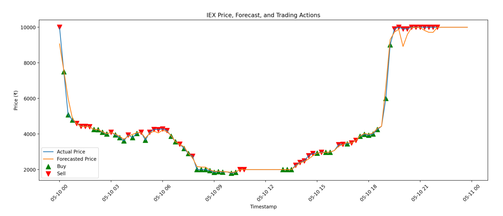

# ⚡ Power Trading Agent for IEX (India)

[](https://share.streamlit.io/) 
[](https://www.python.org/) 
[](LICENSE)

A modern, agentic AI platform for automated trading, forecasting, and analytics on the Indian Energy Exchange (IEX). Features real-time data scraping (no Selenium required!), price forecasting, rule-based trading, backtesting, and a beautiful Streamlit dashboard for visualization and control.

---

## 📊 Demo



---

## 🚀 Features

- **Live IEX Market Data Scraping** (`requests`, `pandas`)
- **Spot Price Forecasting** (Random Forest, scikit-learn)
- **Rule-Based Trading Agent** (customizable logic)
- **Backtesting Engine** (simulate trades, balance, and position)
- **Interactive Streamlit Dashboard**
- **Rich Visualizations** (`matplotlib`)
- **Modular, Extensible Codebase**
- **Cloud Ready** (Streamlit Community Cloud)

---

## 🏗️ Project Structure

```
├── src/
│   ├── app.py                 # Streamlit frontend
│   ├── main.py                # CLI entry point
│   ├── data_fetcher/
│   │   └── iex_api.py         # Requests-based IEX scraper
│   ├── models/
│   │   └── price_forecaster.py
│   ├── agents/
│   │   └── rule_based_agent.py
│   ├── executor/
│   │   └── simulated_executor.py
│   ├── backtester.py          # Backtesting logic
│   └── ...
├── requirements.txt
├── README.md
└── ...
```

---

## ⚙️ Setup & Installation

1. **Clone the repository:**
   ```sh
   git clone https://github.com/TIWARINEERAJ/power-trading-agent.git
   cd power-trading-agent
   ```
2. **Install dependencies:**
   ```sh
   pip install -r requirements.txt
   ```

---

## 🖥️ Local Usage

- **Run the CLI version:**
  ```sh
  python src/main.py
  ```
- **Run the Streamlit Dashboard:**
  ```sh
  streamlit run src/app.py
  ```

---

## ☁️ Deploy on Streamlit Community Cloud

1. Push your code to GitHub.
2. Go to [Streamlit Cloud](https://streamlit.io/cloud)
3. Connect your repo and set the entry point to `src/app.py`.
4. Click Deploy!

---

## 🧠 How It Works

- **Data Fetching:** Uses `requests` to fetch the latest market snapshot from IEX India, then parses the HTML table with `pandas.read_html`.
- **Data Processing:** Cleans and transforms the table for model input.
- **Forecasting:** Trains a Random Forest model on demand, supply, and time features.
- **Trading Agent:** Makes buy/sell/hold decisions using customizable rule-based logic.
- **Backtesting:** Simulates trades, tracks balance and position, and outputs results.
- **Visualization:** Streamlit UI displays tables, charts, and trading actions interactively.

---

## 🛠️ Customization
- **Trading Logic:** Edit `src/agents/rule_based_agent.py` to modify your trading rules.
- **Model:** Swap out the Random Forest for any scikit-learn compatible regressor in `src/models/price_forecaster.py`.
- **Scraper:** Update selectors or URLs in `src/data_fetcher/iex_api.py` if the IEX site changes.

---

## 📈 Roadmap
- [x] Real-time scraping and visualization
- [x] Backtesting and performance metrics
- [x] Interactive dashboard
- [ ] User authentication and personalized order history
- [ ] Price charts with longer historical data
- [ ] Market analysis tools (volume indicators, price trends)
- [ ] Mobile-responsive design improvements
- [ ] Order cancellation functionality
- [ ] Email notifications for completed trades

---

## ❓ FAQ

**Q: Where does the data come from?**  
A: The app fetches live spot market data from the [IEX India](https://www.iexindia.com/) website using HTTP requests and parses the results with pandas.

**Q: Can I use this for live trading?**  
A: This project is for research, education, and prototyping. For production or live trading, thorough testing and additional risk controls are required.

**Q: Can I customize the trading logic or forecasting model?**  
A: Absolutely! Edit `src/agents/rule_based_agent.py` for trading rules or `src/models/price_forecaster.py` for the forecasting model.

**Q: How do I deploy this on Streamlit Cloud?**  
A: Push your code to GitHub, connect your repo on [Streamlit Cloud](https://streamlit.io/cloud), and set the entry point to `src/app.py`.

**Q: The app fails to fetch data. What should I do?**  
A: Check your network, ensure the IEX site is up, and review logs for error messages. If the page structure changes, update the scraping logic in `iex_api.py`.

---

## 🤝 Contributing
Pull requests are welcome! For major changes, please open an issue first to discuss what you would like to change.

---

## 📄 License
This project is licensed under the MIT License.

---

## 🙋‍♂️ Support & Contact
For questions, suggestions, or support, open an issue or contact [@TIWARINEERAJ](https://github.com/TIWARINEERAJ).

---

## 🌱 Acknowledgements
- [IEX India](https://www.iexindia.com/)
- [Streamlit](https://streamlit.io/)
- [scikit-learn](https://scikit-learn.org/)
- [pandas](https://pandas.pydata.org/)
- [matplotlib](https://matplotlib.org/)# Power-Trading-Agent-2
